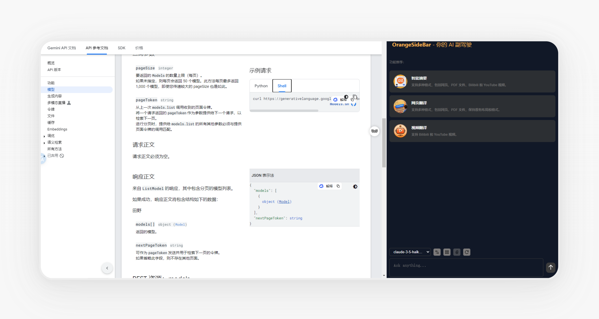
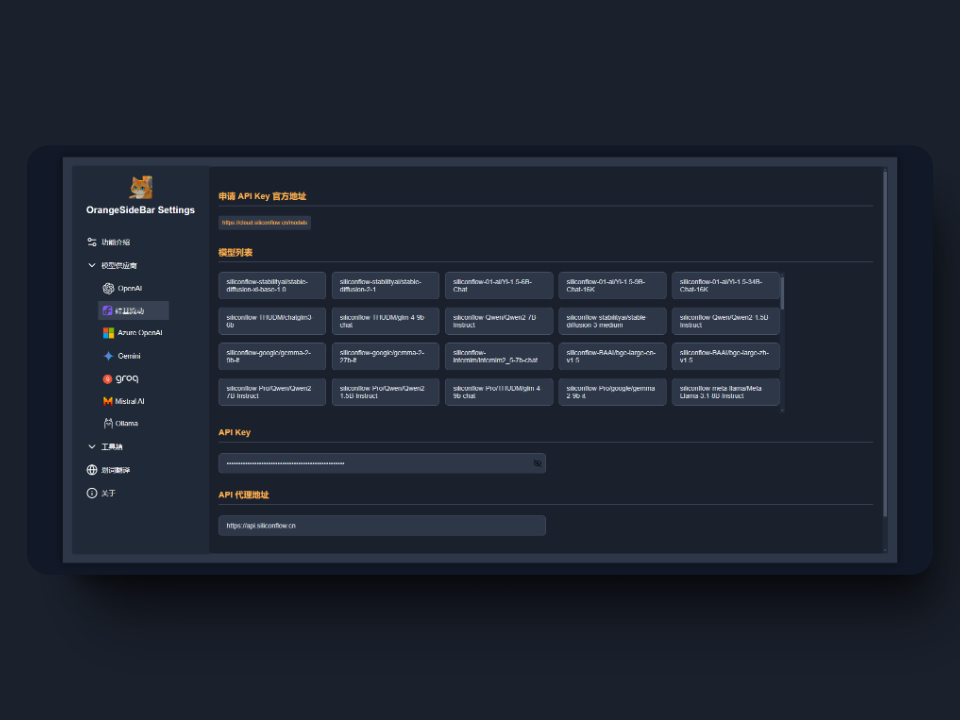

# OrangeSideBar - 网页总结助手

_✨大橘侧边栏：一个开源的网页侧边栏对话总结工具，支持 OpenAI、Gemini 规范的 API，支持自动摘要、网页及视频翻译、多轮对话等功能✨_

## 📖 使用方式

> 等待测试完成后会发布 Chrome 商店

1. 从 `Release` 下载最新的插件

> https://github.com/zhiyu1998/OrangeSideBar/releases

2. 进入插件页面

> chrome://extensions/

3. 点击 `Load unpacked`，将解压后的文件打开

## 🚀 功能支持
- [x] 一键自动摘要
- [x] 一键网页翻译
- [x] 一键 PDF 翻译
- [x] 自定义模型/API密钥/API代理地址
- [x] 支持常见LLM系列模型
- [x] 支持多轮对话
- [x] 支持图片分享
- [x] 支持划词翻译
- [x] 支持联网搜索
- [x] 支持输'/'触发快捷功能，快捷功能包括翻译、摘要、润色、图像转文本、代码解释
- [x] 支持工具箱：联网工具 SerpApi、画图工具 DALLE 3
- [x] OpenAI 规范 API 支持（中转服务商、硅基流动等）

### 🧪 已测试过的规范 && 未来会支持的规范

- [x] OpenAI
- [x] Gemini
- [x] 硅基流动
- [x] 智谱清言
- [x] 月之暗面
- [x] 深度求索
- [x] GitHub Models
- [ ] Azure OpenAl
- [x] groq
- [x] Mistral
- [ ] Ollama

## 🌼 致谢

大部分想法和实现都来自下面的项目，但是由于作者长时间没有维护，就自行写了一个，因为平时用的挺频繁的

- [FisherAI](https://github.com/fisherdaddy/FisherAI)
