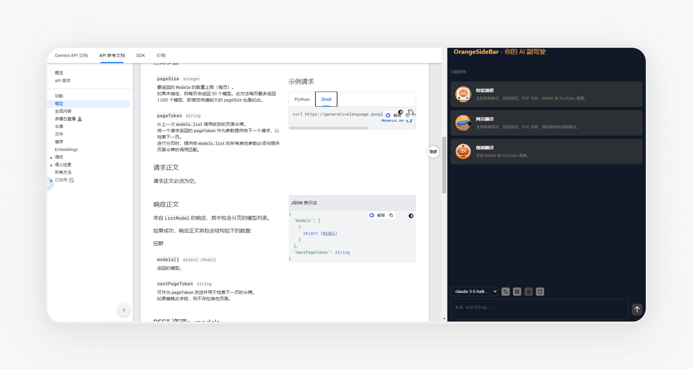
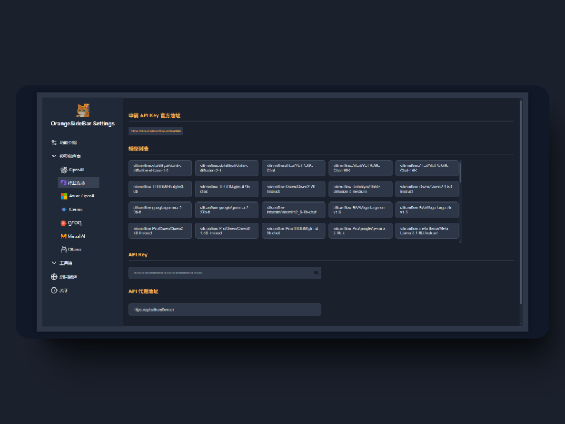
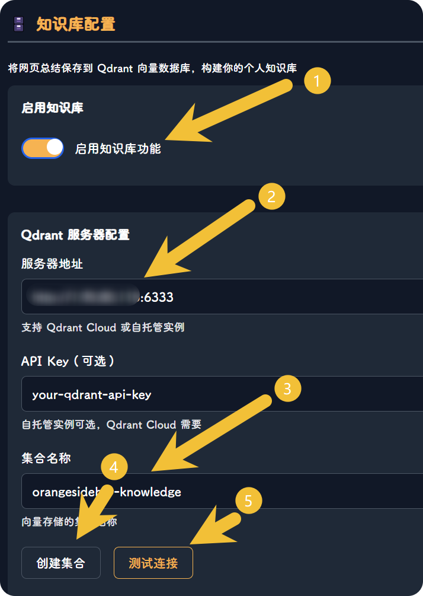

<div align="center">
<a href="https://v2.nonebot.dev/store"></a>

# OrangeSideBar - 网页总结助手

_✨大橘侧边栏：一个开源的网页侧边栏对话总结工具，支持 OpenAI、Gemini、Anthropic 规范的 API，支持自动摘要、网页及视频翻译、多轮对话等功能✨_

</div>





## 📖 使用方式

> 等待测试完成后会发布 Chrome 商店

1. 从 `Release` 下载最新的插件（从 `1.4.6`开始可以直接下载 `crx`文件）

> https://github.com/zhiyu1998/OrangeSideBar/releases

2. 进入插件页面

> chrome://extensions/

3. 点击 `Load unpacked`，将解压后的文件打开

## 🚀 功能支持

- [X] 一键自动摘要
- [X] 一键网页翻译
- [X] 一键 PDF 翻译
- [X] 自定义模型/API密钥/API代理地址
- [X] 支持常见LLM系列模型
- [X] 支持多轮对话
- [X] 支持图片分享
- [X] 支持联网搜索
- [X] 支持输'/'触发快捷功能，快捷功能包括翻译、摘要、润色、图像转文本、代码解释
- [X] 联网工具 SerpApi
- [X] OpenAI 规范 API 支持（中转服务商、硅基流动等）
- [X] 支持本地 PDF 读取总结
- [X] 论文模式，为阅读论文增效
- [X] 知识库，基于Qdrant向量数据库，碎片化知识整理

> PDF 读取总结需要到插件设置开启 `Allow access to file URLs`

## 🗄️ Qdrant 向量数据库快速配置

1、在自己服务器上docker安装一下：

```
docker pull qdrant/qdrant
```

```
docker run -p 6333:6333 -p 6334:6334 \
    -v "$(pwd)/qdrant_storage:/qdrant/storage:z" \
    qdrant/qdrant
```

2、将地址输出到配置页面，创建集合测试一下，最下面有一个保存配置，点一下



## 🌼 致谢

大部分想法和实现都来自下面的项目，但是由于作者长时间没有维护，就自行写了一个，因为平时用的挺频繁的

- [FisherAI](https://github.com/fisherdaddy/FisherAI)
